import RunCode from '../../components/RunCode'
import stateTransitionsCode from '@/snippets/run-code/state-transitions.ts?raw'

# State transitions

`State` describes the card's current FSRS learning phase. A card created with `scheduler.newCard()` starts in `New`. On each review, `DefaultScheduler` combines the FSRS model result with the learning-step policy to determine the next state and due time.



The diagram and table show the default steps. Arrow labels are ratings; an asterisk marks transitions affected by the applicable step and its duration.

Zero-length steps (such as `0m`) currently fall back to the model interval. Negative durations are not supported. The step descriptions below assume non-zero durations.

## What each state means

| State | Meaning | Default queue |
| --- | --- | --- |
| `New` | The card is new or has been reset with `scheduler.forget()`. | `new` |
| `Learning` | The card is progressing through its initial short-term learning steps. | `learning` |
| `Review` | The card is outside short-term learning; its interval may come from the model or a step of one day or longer. | `review` |
| `Relearning` | A card rated `Again` in `Review` is progressing through short-term relearning steps. | `learning` |

## How ratings move a card

With the default learning steps (`1m`, `10m`) and relearning step (`10m`), transitions are:

| Current state | Again | Hard | Good | Easy |
| --- | --- | --- | --- | --- |
| `New` | `Learning` | `Learning` | `Learning` | `Review` |
| `Learning` | Return to the first step | Repeat the current step | Next step or `Review` | `Review` |
| `Review` | `Relearning` | `Review` | `Review` | `Review` |
| `Relearning` | Return to the first step | Repeat the current step | `Review` | `Review` |

A step shorter than one day keeps the card in `Learning` or `Relearning`. A step of one day or longer uses the exact due time but moves the card to `Review`. When short-term scheduling is disabled, the scheduler uses the model interval. It currently also falls back to the model interval when no step applies; this is a known issue, not the intended learning-step behavior.

:::warning Learning states require learning-step policy
`DefaultScheduler` registers `schedulerLearningStepsMiddleware` for you, but it only creates short-term transitions when `enableShortTerm` is `true`. When composing a scheduler with `defineScheduler`, add `.use(schedulerLearningStepsMiddleware)` and configure learning or relearning steps. If short-term scheduling is not enabled, or the middleware is not registered, reviews use the model's long-term interval and do not enter `Learning` or `Relearning`.
:::

Since `Rating.Manual` is not a review grade, you should only pass of `Again`, `Hard`, `Good`, or `Easy` ratings to `review().

## Run the transitions

The example follows both the learning and relearning paths with fixed options, so its output is reproducible. Its helper uses the public `DefaultSchedulerCard`, `Grade`, and `State` types directly.

:::note dueAt is not now
`dueAt` is when the card becomes due, while `now` is the actual review time and should be equal to or later than `dueAt`. To keep the example deterministic without conflating them, the helper reviews each card 30 seconds after `dueAt`.
:::

```ts twoslash file="../../snippets/run-code/state-transitions.ts"
```

<RunCode code={stateTransitionsCode} />

## Card, revlog, and memory state

- The input `card` is the state before a review; `review()` does not mutate it.
- `result.card` contains the next `state`, next FSRS memory state (`stability` and `difficulty`), and next `dueAt`.
- `result.revlog` records the previous state and memory state together with the selected rating and review timing. That snapshot is also what rollback uses to restore the card.
- `scheduleStatus` controls queue membership. By default it maps `New` to `new`, both learning states to `learning`, and `Review` to `review`; middleware may add statuses such as `suspended` without changing the four FSRS states.

Use `card.state` to find the learning phase, and `card.scheduleStatus` to filter scheduling queues.
