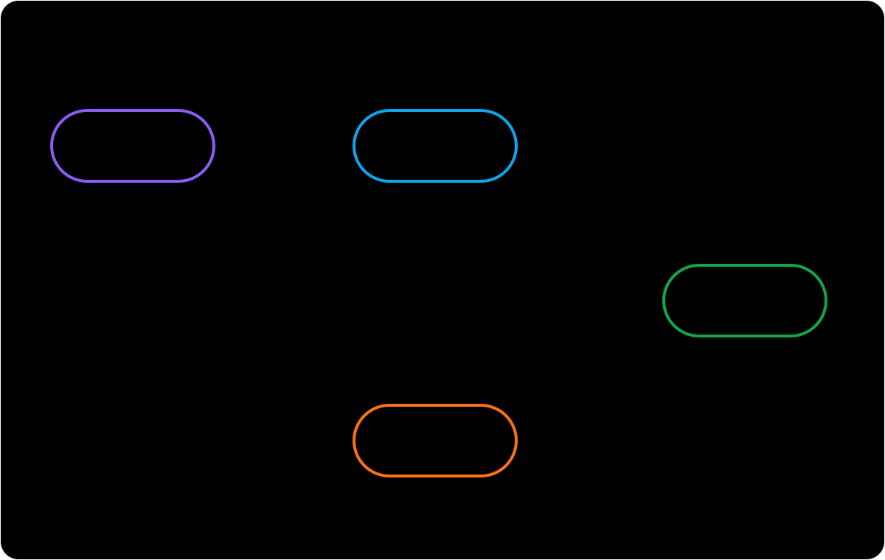

import RunCode from '../../components/RunCode'
import stateTransitionsCode from '@/snippets/run-code/state-transitions.ts?raw'

# State transitions

`State` describes the card's current FSRS learning phase. A card created with `scheduler.newCard()` starts in `New`. On each review, `DefaultScheduler` combines the FSRS model result with the learning-step policy to determine the next state and due time.



The diagram and table show the final scheduled interval, after explicit steps and interval middleware. Ratings affect that interval; they do not alone determine the next state.

`graduatingInterval` (default `1` day) is the shortest interval for a card in `Review`. A final interval shorter than `graduatingInterval` enters or keeps `Learning`/`Relearning`; an interval of `graduatingInterval` or longer enters `Review`. This also applies when steps are disabled or empty and the model supplies the interval.

An exception applies when Again uses a model interval to override an explicit step: the card stays in `Learning`/`Relearning`, even if the final interval reaches `graduatingInterval`. The diagram shows the general interval-based mapping; this exception takes precedence.

Zero-length steps (such as `0m`, or durations that round to zero seconds) count as no step. Negative durations are not supported.

## What each state means

| State | Meaning | Default queue |
| --- | --- | --- |
| `New` | The card is new or has been reset with `scheduler.forget()`. | `new` |
| `Learning` | The card is in it's initial learning state and needs another review. It will stay in it's learning state so long as the next step is shorter than `graduatingInterval`. | `learning` |
| `Review` | The card is outside short-term learning; its interval is at least `graduatingInterval`. | `review` |
| `Relearning` | A previously graduated card is in a learning state again and needs another review. It will stay in a relearning state so long as it's interval is shorter than `graduatingInterval`. | `learning` |

## How ratings move a card

Ratings first determine whether an explicit step supplies the interval. The table below assumes `enableShortTerm: true` and a nonempty step list for the current state: `learningSteps` for `New`/`Learning`, or `relearningSteps` for `Review`/`Relearning`. If that list is empty, the scheduler uses the model interval without a graduation minimum, even if the other list has steps.

The graduation behavior below assumes `maximumInterval >= graduatingInterval` and no other middleware shortens the interval below `graduatingInterval`.

| Rating | `New` / `Learning` / `Relearning` | `Review` |
| --- | --- | --- |
| `Again` | Return to the first step; reset `learningStep` to `0`. | Use the first relearning step; reset `learningStep` to `0`. |
| `Hard` | Keep the current `learningStep`; use the Hard step interval. | Use the model interval, but at least `graduatingInterval`; stay in `Review`. |
| `Good` | Advance when a next step exists; otherwise graduate to `Review` with the model interval, but at least `graduatingInterval`. | Use the model interval, but at least `graduatingInterval`; stay in `Review`. |
| `Easy` | Skip explicit steps and graduate to `Review` with the model interval, but at least `graduatingInterval`. | Use the model interval, but at least `graduatingInterval`; stay in `Review`. |

The Hard step interval is the average of the first two steps, or 1.5 times the only step. With empty steps or `enableShortTerm: false`, every rating uses the model interval, and only the state mapping below applies. `learningStep` keeps the next step only while the card stays in `Learning`/`Relearning`; it resets to `0` when the card enters `Review`.

When `allowModelOverride` is enabled (the FSRS-7 default in `DefaultScheduler`), the scheduler uses the interval from the model instead of the current step if the interval from the model is longer. For Again, the model's interval is capped at `graduatingInterval`, and an Again that uses it always enters `Learning`/`Relearning`. For Hard and Good, a card whose interval reaches `graduatingInterval` graduates to `Review` without finishing the remaining steps. Interval middleware can still adjust model intervals.

If `maximumInterval < graduatingInterval`, the cap can prevent graduation. For example, with `graduatingInterval: 2` and `maximumInterval: 1`, finishing the learning steps produces a model-based interval capped at 1 day, so the card stays in `Learning`.

After the interval is resolved, `schedulerLearningStepsMiddleware` uses the table below to determine the next state. The Again override exception described above takes precedence. The table shows state transitions, not how each rating selects an interval:

| Current state | Final interval < `graduatingInterval` | Final interval ≥ `graduatingInterval` |
| --- | --- | --- |
| `New` | `Learning` | `Review` |
| `Learning` | `Learning` | `Review` |
| `Review` | `Relearning` | `Review` |
| `Relearning` | `Relearning` | `Review` |

When an explicit step applies, the scheduler keeps its configured duration unless the model from `allowModelOverride` provides a longer interval. A step of `graduatingInterval` or longer still moves the card to `Review`.

:::warning Learning states require the `schedulerLearningStepsMiddleware` middleware
`DefaultScheduler` registers a `schedulerLearningStepsMiddleware` and defaults `enableShortTerm` to `true` including for FSRS-7. For FSRS-7, this flag controls explicit `learningSteps` and `relearningSteps`, not its intrinsic fast trace or the interval-based state mapping. With `enableShortTerm: false`, an interval below `graduatingInterval` still enters the `Learning` or `Relearning` phase.

If you compose with `defineScheduler`, register the middleware with `.use(schedulerLearningStepsMiddleware)` to get this state mapping; without it, the default behaviour remains `Review` with `scheduleStatus: review`, even when FSRS-7 returns an interval below one day. The model computes memory states and intervals; learning-state transitions are middleware behavior. To produce `Learning`/`Relearning` states after FSRS-7 scheduling, register `schedulerLearningStepsMiddleware` or implement your own state-transition middleware.
:::

`Rating.Manual` is not a review grade. Pass one of `Again`, `Hard`, `Good`, or `Easy` to `review()`.

## Run the transitions

The runnable example below uses the default FSRS-7 model with this configuration:

```ts
const scheduler = await DefaultScheduler({
  learningSteps: ['1m', '10m'],
  relearningSteps: ['10m'],
  enableFuzz: false,
  allowModelOverride: false,
})
```

`graduatingInterval` uses its default of **1 day**. The card starts in `New` with `learningStep: 0`. `learningStep` is a zero-based step index, not a review count; the same field tracks progress through either the learning or relearning steps.

With `allowModelOverride: false`, the example produces these transitions:

| Current state | Current learningStep | Rating | Resulting state | Resulting learningStep | Interval |
| --- | --- | --- | --- | --- | --- |
| New | 0 | Again | Learning | 0 | 1 minute |
| Learning | 0 | Good | Learning | 1 | 10 minutes |
| Learning | 1 | Hard | Learning | 1 | 5.5 minutes |
| Learning | 1 | Again | Learning | 0 | 1 minute |
| Learning | 1 | Good | Review | 0 | 1 day |
| Review | 0 | Again | Relearning | 0 | 10 minutes |
| Relearning | 0 | Good | Review | 0 | 1 day |

The Hard, Again, and Good rows at `learningStep: 1` are alternative ratings of the same card, not consecutive reviews. The relearning branch starts from a separate card that reached `Review` via Easy.

Disabling `allowModelOverride` keeps the configured step intervals. If enabled, a longer model interval can replace an explicit step. For example, a hypothetical 30-minute model interval would extend the 10-minute Good step to 30 minutes. A shorter model interval would leave that step unchanged. The scheduler still uses model intervals after the steps finish or when no step applies, even with `allowModelOverride: false`.

The full example below uses the public `DefaultSchedulerCard`, `Grade`, and `State` types. Its output shows intervals in minutes rounded to two decimals.

:::note dueAt is not now
`dueAt` is when the card becomes due, while `now` is the actual review time and should be equal to or later than `dueAt`. To keep the example deterministic without conflating them, the helper reviews each card 30 seconds after `dueAt`.
:::

```ts twoslash file="../../snippets/run-code/state-transitions.ts"
```

<RunCode code={stateTransitionsCode} />

## Card, revlog, and memory state

- The input `card` is the state before a review; `review()` does not mutate it.
- `result.card` contains the next `state`, next FSRS memory state (`stability`, `stabilityFast`, and `difficulty` for FSRS-7), and next `dueAt`.
- `result.revlog` records the previous state and memory state together with the selected rating and review timing. That snapshot is also what rollback uses to restore the card.
- `scheduleStatus` controls queue membership. By default it maps `New` to `new`, both learning states to `learning`, and `Review` to `review`; middleware may add statuses such as `suspended` without changing the four FSRS states.

Use `card.state` to find the learning phase, and `card.scheduleStatus` to filter scheduling queues.
