import RunCode from '../../components/RunCode'
import stateTransitionsCode from '@/snippets/run-code/state-transitions.ts?raw'

# 状態遷移

`State` はカードの現在の FSRS 学習段階を表します。`scheduler.newCard()` で作成したカードの初期状態は `New` です。復習するたびに、`DefaultScheduler` は FSRS モデルの結果と学習ステップのポリシーを組み合わせて、次の状態と次回予定時刻を決定します。



図と表は既定のステップでの遷移を示します。矢印のラベルは評価を表し、アスタリスクは適用されるステップとその長さによって遷移が変わることを示します。

長さがゼロのステップ（`0m` など）は、現在モデルの間隔にフォールバックします。負の長さは指定できません。以下のステップの説明では、長さがゼロでないことを前提とします。

## 4 つの状態

| 状態 | 意味 | 既定のキュー |
| --- | --- | --- |
| `New` | 新規カード、または `scheduler.forget()` でリセットされたカードです。 | `new` |
| `Learning` | 初回の短期学習ステップを進めているカードです。 | `learning` |
| `Review` | 短期学習段階ではないカードです。間隔はモデル、または 1 日以上のステップによって決まります。 | `review` |
| `Relearning` | `Review` で `Again` と評価され、短期の再学習ステップを進めているカードです。 | `learning` |

## 評価による状態遷移

既定の学習ステップ（`1m`、`10m`）と再学習ステップ（`10m`）では、次のように遷移します。

| 現在の状態 | Again | Hard | Good | Easy |
| --- | --- | --- | --- | --- |
| `New` | `Learning` | `Learning` | `Learning` | `Review` |
| `Learning` | 最初のステップに戻る | 現在のステップを繰り返す | 次のステップまたは `Review` | `Review` |
| `Review` | `Relearning` | `Review` | `Review` | `Review` |
| `Relearning` | 最初のステップに戻る | 現在のステップを繰り返す | `Review` | `Review` |

1 日未満のステップでは、カードは `Learning` または `Relearning` に留まります。1 日以上のステップでは正確な次回予定時刻を保ったまま、カードを `Review` に移します。短期スケジューリングが無効な場合は、モデルの間隔が使われます。適用できるステップがない場合にも、現在はモデルの間隔へフォールバックしますが、これは本来の学習ステップ動作ではなく既知の問題です。

:::warning Learning 状態には学習ステップのポリシーが必要です
`DefaultScheduler` は `schedulerLearningStepsMiddleware` を自動で登録しますが、短期の状態遷移が作られるのは `enableShortTerm` が `true` の場合だけです。`defineScheduler` でスケジューラーを組み立てる場合は、`.use(schedulerLearningStepsMiddleware)` を追加して学習または再学習ステップを設定してください。短期スケジューリングが有効でない場合、または middleware が登録されていない場合、復習にはモデルの長期の間隔が使われ、`Learning` や `Relearning` には入りません。
:::

`Rating.Manual` は復習の評価ではありません。`review()` には `Again`、`Hard`、`Good`、`Easy` のいずれかを渡します。

## 状態遷移を実行する

この例は固定した設定で学習と再学習の両方の経路をたどるため、出力を再現できます。ヘルパーは公開されている `DefaultSchedulerCard`、`Grade`、`State` 型を直接使います。

:::note dueAt と now は別の時刻です
`dueAt` はカードの復習予定時刻、`now` は実際の復習時刻です。通常、`now` は `dueAt` 以降である必要があります。この例では両者を混同せずに出力を再現できるよう、各カードを `dueAt` の 30 秒後に復習します。
:::

```ts twoslash file="../../snippets/run-code/state-transitions.ts"
```

<RunCode code={stateTransitionsCode} />

## Card、revlog、記憶状態

- 入力 `card` は復習前の状態です。`review()` は入力を変更しません。
- `result.card` には次の `state`、次の FSRS 記憶状態（`stability` と `difficulty`）、新しい `dueAt` が入ります。
- `result.revlog` は、選んだ評価と復習時刻に加えて、以前の状態と記憶状態を記録します。rollback もこのスナップショットからカードを復元します。
- `scheduleStatus` はカードが属するスケジューリングキューを決めます。既定では `New` が `new`、2 つの学習状態が `learning`、`Review` が `review` に対応します。middleware は 4 つの FSRS 状態を変えずに `suspended` などを追加できます。

学習フェーズの説明には `card.state`、スケジューリングキューの絞り込みには `card.scheduleStatus` を使います。
