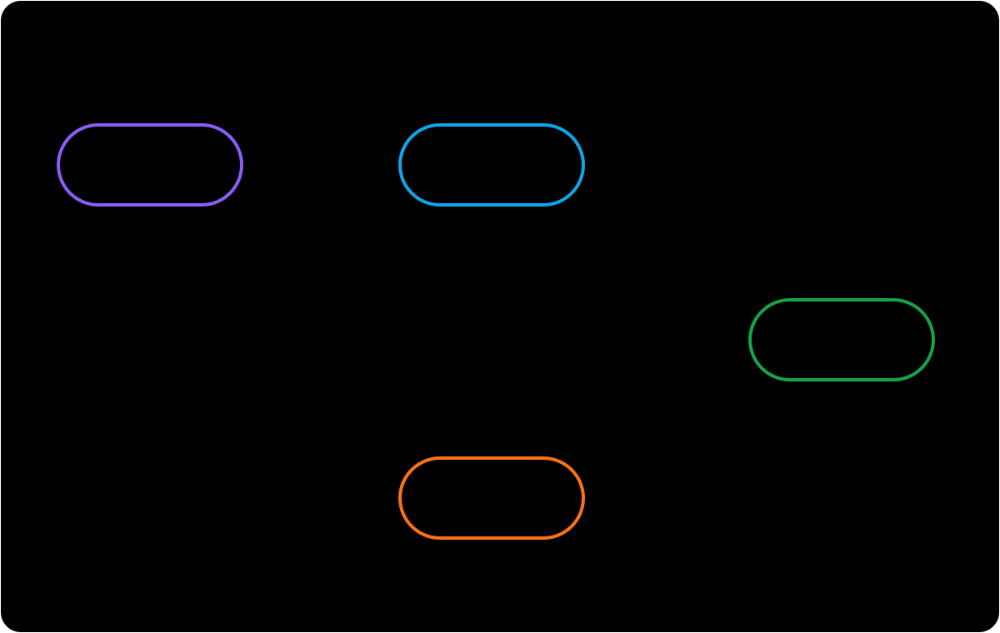

import RunCode from '../../components/RunCode'
import stateTransitionsCode from '@/snippets/run-code/state-transitions.ts?raw'

# 状態遷移

`State` はカードの現在の FSRS 学習段階を表します。`scheduler.newCard()` で作成したカードの初期状態は `New` です。復習するたびに、`DefaultScheduler` は FSRS モデルの結果と学習ステップのポリシーを組み合わせて、次の状態と次回予定時刻を決定します。



図と表は、明示的なステップと間隔ミドルウェアの処理後の最終間隔に基づく遷移を示します。評価は間隔に影響しますが、評価だけでは次の状態は決まりません。

`graduatingInterval`（既定値 `1`、単位は日）は、`Review` のカードの最短間隔です。最終間隔が `graduatingInterval` より短ければ `Learning`/`Relearning` に入り、または留まります。`graduatingInterval` 以上なら `Review` に移ります。ステップが無効または空で、モデルが間隔を決める場合も同じです。

ただし、Again でモデルの間隔が明示的なステップを上書きした場合は例外です。最終間隔が `graduatingInterval` に達しても、カードは `Learning`/`Relearning` に留まります。図は間隔による一般的な状態遷移を示しており、この例外が優先されます。

長さがゼロのステップ（`0m` や秒単位の四捨五入でゼロになる長さ）はステップなしとして扱います。負の長さは指定できません。

## 4 つの状態

| 状態 | 意味 | 既定のキュー |
| --- | --- | --- |
| `New` | 新規カード、または `scheduler.forget()` でリセットされたカードです。 | `new` |
| `Learning` | 初回学習中で、再度復習が必要なカードです。間隔は通常 `graduatingInterval` 未満です。 | `learning` |
| `Review` | 短期学習段階ではないカードです。間隔は `graduatingInterval` 以上です。 | `review` |
| `Relearning` | 再学習中で、再度復習が必要な既習カードです。間隔は通常 `graduatingInterval` 未満です。 | `learning` |

## 評価による状態遷移

評価によって、明示的なステップの間隔を使うかどうかが決まります。次の表は `enableShortTerm: true` で、現在の状態に対応するステップ一覧が空でない場合を示します。`New`/`Learning` には `learningSteps`、`Review`/`Relearning` には `relearningSteps` を使います。その一覧が空なら、もう一方の一覧にステップがあっても、卒業の下限を適用せずモデルの間隔を使います。

以下の卒業動作は `maximumInterval >= graduatingInterval` で、他のミドルウェアが間隔を `graduatingInterval` 未満に短縮しないことを前提とします。

| 評価 | `New` / `Learning` / `Relearning` | `Review` |
| --- | --- | --- |
| `Again` | 最初のステップに戻り、`learningStep` を `0` に戻します。 | 最初の再学習ステップを使い、`learningStep` を `0` に戻します。 |
| `Hard` | 現在の `learningStep` を維持し、Hard 用のステップ間隔を使います。 | モデルの間隔を使い（`graduatingInterval` 以上）、`Review` に留まります。 |
| `Good` | 次のステップがあれば進めます。なければモデルの間隔（`graduatingInterval` 以上）で `Review` に卒業します。 | モデルの間隔を使い（`graduatingInterval` 以上）、`Review` に留まります。 |
| `Easy` | 明示的なステップを飛ばし、モデルの間隔（`graduatingInterval` 以上）で `Review` に卒業します。 | モデルの間隔を使い（`graduatingInterval` 以上）、`Review` に留まります。 |

Hard 用の間隔は最初の 2 ステップの平均で、ステップが 1 つならその 1.5 倍です。ステップが空、または `enableShortTerm: false` の場合は、すべての評価がモデルの間隔を使い、下の状態の割り当てだけが適用されます。`learningStep` はカードが `Learning`/`Relearning` に留まる間だけ次のステップを保持し、カードが `Review` に移ると `0` に戻ります。

`allowModelOverride` が有効な場合（`DefaultScheduler` では FSRS-7 の既定）、モデルの間隔が現在のステップより長ければ、スケジューラーはモデルの間隔を使います。Again ではモデルの間隔が `graduatingInterval` までに制限され、モデルの間隔を使う Again は常に `Learning`/`Relearning` に入ります。Hard と Good では、間隔が `graduatingInterval` に達すると、残りのステップを終えずに `Review` に卒業します。モデルの間隔は、他の間隔ミドルウェアで調整されることがあります。

`maximumInterval < graduatingInterval` の場合、上限によって卒業できないことがあります。例えば、`graduatingInterval: 2` と `maximumInterval: 1` を設定すると、学習ステップ完了後のモデルの間隔が 1 日に制限されるため、カードは `Learning` に留まります。

間隔が決まった後、`schedulerLearningStepsMiddleware` が次の表に従って状態を決めます。ただし、上記の Again によるモデル上書きの例外が優先されます。表は状態遷移を示し、各評価の間隔選択ルールが同じという意味ではありません。

| 現在の状態 | 最終間隔 < `graduatingInterval` | 最終間隔 ≥ `graduatingInterval` |
| --- | --- | --- |
| `New` | `Learning` | `Review` |
| `Learning` | `Learning` | `Review` |
| `Review` | `Relearning` | `Review` |
| `Relearning` | `Relearning` | `Review` |

適用される明示的なステップがある場合は、`allowModelOverride` がより長いモデル間隔を選ばない限り、そのステップに設定された間隔を保ちます。`graduatingInterval` 以上のステップでも、カードは `Review` に移ります。

:::warning Learning 状態にはミドルウェアが必要です
`DefaultScheduler` は `schedulerLearningStepsMiddleware` を登録し、FSRS-7 を含め `enableShortTerm` の既定値は `true` です。FSRS-7 では、この設定は明示的な `learningSteps` と `relearningSteps` を制御し、モデル固有の短期記憶や間隔による状態の割り当てを無効にはしません。`enableShortTerm: false` でも、モデルの間隔が `graduatingInterval` 未満なら `Learning` または `Relearning` に入ります。`defineScheduler` でこの状態遷移を使うには `.use(schedulerLearningStepsMiddleware)` を登録してください。FSRS-7 モデルだけを組み合わせ、このミドルウェアを登録しない場合、間隔が 1 日未満でも `state` は `Review`、`scheduleStatus` は `review` のままです。モデルは記憶状態と間隔を計算し、学習状態への遷移はミドルウェアが担当します。FSRS-7 のスケジューリング後に `Learning`/`Relearning` にするには、`schedulerLearningStepsMiddleware` を登録するか、状態遷移を担う独自のミドルウェアを実装してください。
:::

`Rating.Manual` は復習の評価ではありません。`review()` には `Again`、`Hard`、`Good`、`Easy` のいずれかを渡します。

## 状態遷移を実行する

以下の実行可能な例では、既定の FSRS-7 モデルを次の設定で使います。

```ts
const scheduler = await DefaultScheduler({
  learningSteps: ['1m', '10m'],
  relearningSteps: ['10m'],
  enableFuzz: false,
  allowModelOverride: false,
})
```

`graduatingInterval` は既定値の **1 日**を使います。カードの初期状態は `New`、`learningStep: 0` です。`learningStep` はゼロ始まりのステップ番号で、復習回数ではありません。学習と再学習の進捗は同じフィールドで管理します。

`allowModelOverride: false` の場合、例では次のように遷移します。

| 現在の状態 | 現在の learningStep | 評価 | 遷移後の状態 | 遷移後の learningStep | 間隔 |
| --- | --- | --- | --- | --- | --- |
| New | 0 | Again | Learning | 0 | 1 分 |
| Learning | 0 | Good | Learning | 1 | 10 分 |
| Learning | 1 | Hard | Learning | 1 | 5.5 分 |
| Learning | 1 | Again | Learning | 0 | 1 分 |
| Learning | 1 | Good | Review | 0 | 1 日 |
| Review | 0 | Again | Relearning | 0 | 10 分 |
| Relearning | 0 | Good | Review | 0 | 1 日 |

`learningStep: 1` の Hard、Again、Good の行は、同じカードに対する別々の評価であり、連続した復習ではありません。再学習の分岐は、Easy で `Review` に移った別のカードから始まります。

`allowModelOverride` を無効にすると、設定したステップの間隔を保ちます。有効な場合、より長いモデルの間隔が明示的なステップを置き換えます。例えば、仮にモデルの間隔が 30 分なら、10 分の Good ステップは 30 分に延びます。モデルの間隔が短ければ、そのステップは変わりません。`allowModelOverride: false` でも、ステップ完了後や適用されるステップがない場合はモデルの間隔を使います。

以下の完全な例は公開の `DefaultSchedulerCard`、`Grade`、`State` 型を使い、間隔を分単位で小数点以下 2 桁に丸めて表示します。

:::note dueAt と now は別の時刻です
`dueAt` はカードの復習予定時刻、`now` は実際の復習時刻です。通常、`now` は `dueAt` 以降である必要があります。この例では両者を混同せずに出力を再現できるよう、各カードを `dueAt` の 30 秒後に復習します。
:::

```ts twoslash file="../../snippets/run-code/state-transitions.ts"
```

<RunCode code={stateTransitionsCode} />

## Card、revlog、記憶状態

- 入力 `card` は復習前の状態です。`review()` は入力を変更しません。
- `result.card` には次の `state`、次の FSRS 記憶状態（FSRS-7 では `stability`、`stabilityFast`、`difficulty`）、新しい `dueAt` が入ります。
- `result.revlog` は、選んだ評価と復習時刻に加えて、以前の状態と記憶状態を記録します。rollback もこのスナップショットからカードを復元します。
- `scheduleStatus` はカードが属するスケジューリングキューを決めます。既定では `New` が `new`、2 つの学習状態が `learning`、`Review` が `review` に対応します。middleware は 4 つの FSRS 状態を変えずに `suspended` などを追加できます。

学習フェーズの説明には `card.state`、スケジューリングキューの絞り込みには `card.scheduleStatus` を使います。
