import RunCode from '../../components/RunCode'
import stateTransitionsCode from '@/snippets/run-code/state-transitions.ts?raw'

# 状态转换

`State` 表示卡片当前所处的 FSRS 学习阶段。通过 `scheduler.newCard()` 创建的卡片初始状态为 `New`。每次复习时，`DefaultScheduler` 会结合 FSRS 模型结果与学习步骤策略，确定下一个状态和到期时间。



图表展示默认步骤下的转换。箭头文字表示评分；星号表示转换受适用步骤及其时长影响。

零时长步骤（如 `0m`）目前会回退到模型间隔，不支持负数时长。下文的步骤描述均假定时长非零。

## 四种状态

| 状态 | 含义 | 默认队列 |
| --- | --- | --- |
| `New` | 卡片是新卡，或已通过 `scheduler.forget()` 重置。 | `new` |
| `Learning` | 卡片正在进行初始的短期学习步骤。 | `learning` |
| `Review` | 卡片不处于短期学习阶段；间隔可能来自模型，也可能来自一天或更长的步骤。 | `review` |
| `Relearning` | 处于 `Review` 的卡片被评为 `Again` 后，正在进行短期重新学习步骤。 | `learning` |

## 评分如何改变状态

使用默认学习步骤（`1m`、`10m`）和重新学习步骤（`10m`）时，转换如下：

| 当前状态 | Again | Hard | Good | Easy |
| --- | --- | --- | --- | --- |
| `New` | `Learning` | `Learning` | `Learning` | `Review` |
| `Learning` | 回到第一个步骤 | 重复当前步骤 | 下一步骤或 `Review` | `Review` |
| `Review` | `Relearning` | `Review` | `Review` | `Review` |
| `Relearning` | 回到第一个步骤 | 重复当前步骤 | `Review` | `Review` |

小于一天的步骤会让卡片停留在 `Learning` 或 `Relearning`。一天或更长的步骤仍保留精确到期时间，但会把卡片转为 `Review`。关闭短期调度时，调度器会使用模型间隔。目前，没有适用的步骤时也会回退到模型间隔；这是已知问题，并非学习步骤的预期行为。

:::warning Learning 状态依赖学习步骤策略
`DefaultScheduler` 已自动注册 `schedulerLearningStepsMiddleware`，但只有 `enableShortTerm` 为 `true` 时才会产生短期状态转换。使用 `defineScheduler` 组合调度器时，需要添加 `.use(schedulerLearningStepsMiddleware)` 并配置学习或重新学习步骤。未启用短期调度或未注册该 middleware 时，复习会使用模型的长期间隔，不会进入 `Learning` 或 `Relearning`。
:::

`Rating.Manual` 不是复习评分。调用 `review()` 时应传入 `Again`、`Hard`、`Good` 或 `Easy`。

## 运行状态转换

示例使用固定配置分别走完学习和重新学习路径，因此输出可重复验证。辅助函数直接使用公开的 `DefaultSchedulerCard`、`Grade` 和 `State` 类型。

:::note dueAt 不是 now
`dueAt` 表示卡片应从何时起复习，`now` 是实际复习时间，通常应满足 `now >= dueAt`。为了让输出可重复且不混淆两者，本例在每张卡片的 `dueAt` 后 30 秒进行复习。
:::

```ts twoslash file="../../snippets/run-code/state-transitions.ts"
```

<RunCode code={stateTransitionsCode} />

## Card、revlog 与记忆状态

- 输入 `card` 表示复习前的状态；`review()` 不会修改它。
- `result.card` 包含下一个 `state`、下一组 FSRS 记忆状态（`stability` 与 `difficulty`）以及新的 `dueAt`。
- `result.revlog` 会连同评分和复习时间记录之前的状态与记忆状态；rollback 也使用这份快照恢复卡片。
- `scheduleStatus` 决定卡片进入哪个调度队列。默认情况下，`New` 对应 `new`，两个学习状态对应 `learning`，`Review` 对应 `review`；middleware 可以增加 `suspended` 等队列状态，而不会改变四种 FSRS 状态。

用 `card.state` 解释学习阶段，用 `card.scheduleStatus` 筛选调度队列。
