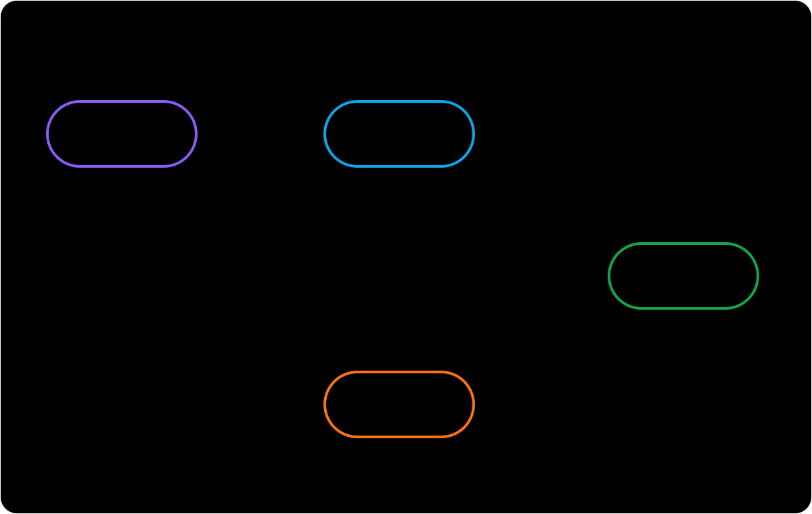

import RunCode from '../../components/RunCode'
import stateTransitionsCode from '@/snippets/run-code/state-transitions.ts?raw'

# 状态转换

`State` 表示卡片当前所处的 FSRS 学习阶段。通过 `scheduler.newCard()` 创建的卡片初始状态为 `New`。每次复习时，`DefaultScheduler` 会结合 FSRS 模型结果与学习步骤策略，确定下一个状态和到期时间。



图表按显式步骤和间隔中间件处理后的最终调度间隔分类。评分会影响间隔，但不能单独决定下一个状态。

`graduatingInterval`（默认 `1`，单位为天）是卡片处于 `Review` 时的最短间隔。最终间隔短于 `graduatingInterval` 时进入或保持 `Learning`/`Relearning`；达到 `graduatingInterval` 时进入 `Review`。步骤被关闭或为空、由模型提供间隔时，也适用这一规则。

有一个例外：Again 使用模型间隔覆盖显式步骤时，即使最终间隔达到 `graduatingInterval`，卡片仍保持 `Learning`/`Relearning`。流程图展示的是一般的间隔映射规则，此例外优先于图中的规则。

零时长步骤（如 `0m`，或按秒四舍五入后为零的时长）视为没有步骤，不支持负数时长。

## 四种状态

| 状态 | 含义 | 默认队列 |
| --- | --- | --- |
| `New` | 卡片是新卡，或已通过 `scheduler.forget()` 重置。 | `new` |
| `Learning` | 卡片处于初始学习阶段，需要再次复习，间隔通常短于 `graduatingInterval`。 | `learning` |
| `Review` | 卡片不处于短期学习阶段，间隔至少为 `graduatingInterval`。 | `review` |
| `Relearning` | 已复习过的卡片正在重新学习，需要再次复习，间隔通常短于 `graduatingInterval`。 | `learning` |

## 评分如何改变状态

评分首先决定是否使用显式步骤间隔。下表假设 `enableShortTerm: true`，且当前状态使用的步骤列表非空：`New`/`Learning` 使用 `learningSteps`，`Review`/`Relearning` 使用 `relearningSteps`。如果该列表为空，即使另一列表配置了步骤，调度器也使用模型间隔而不应用毕业下限。

下文的毕业行为假设 `maximumInterval >= graduatingInterval`，且没有其他中间件将间隔缩短到 `graduatingInterval` 以下。

| 评分 | `New` / `Learning` / `Relearning` | `Review` |
| --- | --- | --- |
| `Again` | 回到第一个步骤，`learningStep` 重置为 `0`。 | 使用第一个重新学习步骤，`learningStep` 重置为 `0`。 |
| `Hard` | 保持当前 `learningStep`，使用 Hard 步骤间隔。 | 使用模型间隔，但不短于 `graduatingInterval`；保持 `Review`。 |
| `Good` | 存在下一步时推进；否则毕业进入 `Review`，使用模型间隔，但不短于 `graduatingInterval`。 | 使用模型间隔，但不短于 `graduatingInterval`；保持 `Review`。 |
| `Easy` | 跳过显式步骤，毕业进入 `Review`，使用模型间隔，但不短于 `graduatingInterval`。 | 使用模型间隔，但不短于 `graduatingInterval`；保持 `Review`。 |

Hard 步骤间隔为前两个步骤时长的平均值；只有一个步骤时，为该步骤时长的 1.5 倍。步骤为空或 `enableShortTerm: false` 时，所有评分都使用模型间隔，只适用下方的状态映射。`learningStep` 只在卡片留在 `Learning`/`Relearning` 时保留下一步骤，卡片进入 `Review` 时重置为 `0`。

开启 `allowModelOverride`（`DefaultScheduler` 对 FSRS-7 默认开启）时，如果模型间隔比当前步骤长，调度器改用模型间隔。Again 的模型间隔不超过 `graduatingInterval`，使用模型间隔的 Again 总是进入 `Learning`/`Relearning`。Hard 和 Good 的间隔达到 `graduatingInterval` 时，卡片不必走完剩余步骤即毕业进入 `Review`。模型间隔仍可能被其他间隔中间件调整。

如果 `maximumInterval < graduatingInterval`，上限可能阻止毕业。例如，设置 `graduatingInterval: 2` 和 `maximumInterval: 1` 时，走完学习步骤后的模型间隔被限制为 1 天，因此卡片仍处于 `Learning`。

间隔确定后，`schedulerLearningStepsMiddleware` 按下表决定状态。上文的 Again 模型覆盖例外优先于此表。下表描述状态转换，不代表各评分使用相同的间隔选择规则：

| 当前状态 | 最终间隔 < `graduatingInterval` | 最终间隔 ≥ `graduatingInterval` |
| --- | --- | --- |
| `New` | `Learning` | `Review` |
| `Learning` | `Learning` | `Review` |
| `Review` | `Relearning` | `Review` |
| `Relearning` | `Relearning` | `Review` |

有适用的显式步骤时，调度器保留该步骤配置的时长，除非 `allowModelOverride` 选用了更长的模型间隔。达到 `graduatingInterval` 的步骤仍会让卡片进入 `Review`。

:::warning Learning 状态依赖中间件
`DefaultScheduler` 自动注册 `schedulerLearningStepsMiddleware`，且 `enableShortTerm` 默认为 `true`，FSRS-7 也一样。对于 FSRS-7，该开关控制显式 `learningSteps` 和 `relearningSteps`，不关闭模型内在的短期记忆，也不控制按间隔进行的状态映射。即使 `enableShortTerm: false`，模型间隔小于 `graduatingInterval` 时仍会进入 `Learning` 或 `Relearning`。使用 `defineScheduler` 时，需注册 `.use(schedulerLearningStepsMiddleware)` 才会应用此状态映射；只组合 FSRS-7 模型而未注册该中间件时，即使调度间隔小于一天，`state` 仍为 `Review`，`scheduleStatus` 仍为 `review`。模型负责记忆状态和间隔计算，学习状态转换由中间件负责。如果要让 FSRS-7 调度后显示 `Learning`/`Relearning`，请挂载 `schedulerLearningStepsMiddleware`，或自行实现负责状态转换的 middleware。
:::

`Rating.Manual` 不是复习评分。调用 `review()` 时应传入 `Again`、`Hard`、`Good` 或 `Easy`。

## 运行状态转换

下方的可运行示例使用默认 FSRS-7 模型和以下配置：

```ts
const scheduler = await DefaultScheduler({
  learningSteps: ['1m', '10m'],
  relearningSteps: ['10m'],
  enableFuzz: false,
  allowModelOverride: false,
})
```

`graduatingInterval` 使用默认值 **1 天**。卡片初始状态为 `New`，`learningStep: 0`。`learningStep` 是从零开始的步骤索引，不是复习次数；学习和重新学习都使用同一个字段记录步骤进度。

设置 `allowModelOverride: false` 时，示例产生以下转换：

| 当前状态 | 当前 learningStep | 评分 | 转换后状态 | 转换后 learningStep | 间隔 |
| --- | --- | --- | --- | --- | --- |
| New | 0 | Again | Learning | 0 | 1 分钟 |
| Learning | 0 | Good | Learning | 1 | 10 分钟 |
| Learning | 1 | Hard | Learning | 1 | 5.5 分钟 |
| Learning | 1 | Again | Learning | 0 | 1 分钟 |
| Learning | 1 | Good | Review | 0 | 1 天 |
| Review | 0 | Again | Relearning | 0 | 10 分钟 |
| Relearning | 0 | Good | Review | 0 | 1 天 |

`learningStep: 1` 的 Hard、Again 和 Good 行是对同一张卡片的不同评分分支，并非连续复习。重新学习分支从另一张通过 Easy 进入 `Review` 的卡片开始。

关闭 `allowModelOverride` 会保留配置的步骤间隔。开启后，更长的模型间隔可以替代显式步骤。例如，假设模型间隔为 30 分钟，原本 10 分钟的 Good 步骤就会延长到 30 分钟；如果模型间隔更短，则该步骤保持不变。即使设置 `allowModelOverride: false`，调度器在步骤完成后或没有适用步骤时仍会使用模型间隔。

下方完整示例使用公开的 `DefaultSchedulerCard`、`Grade` 和 `State` 类型，输出间隔以分钟显示，保留两位小数。

:::note dueAt 不是 now
`dueAt` 表示卡片应从何时起复习，`now` 是实际复习时间，通常应满足 `now >= dueAt`。为了让输出可重复且不混淆两者，本例在每张卡片的 `dueAt` 后 30 秒进行复习。
:::

```ts twoslash file="../../snippets/run-code/state-transitions.ts"
```

<RunCode code={stateTransitionsCode} />

## Card、revlog 与记忆状态

- 输入 `card` 表示复习前的状态；`review()` 不会修改它。
- `result.card` 包含下一个 `state`、下一组 FSRS 记忆状态（FSRS-7 的 `stability`、`stabilityFast` 与 `difficulty`）以及新的 `dueAt`。
- `result.revlog` 会连同评分和复习时间记录之前的状态与记忆状态；rollback 也使用这份快照恢复卡片。
- `scheduleStatus` 决定卡片进入哪个调度队列。默认情况下，`New` 对应 `new`，两个学习状态对应 `learning`，`Review` 对应 `review`；middleware 可以增加 `suspended` 等队列状态，而不会改变四种 FSRS 状态。

用 `card.state` 解释学习阶段，用 `card.scheduleStatus` 筛选调度队列。
