import RunCode from '../../components/RunCode'
import stateTransitionsCode from '@/snippets/run-code/state-transitions.ts?raw'

# 狀態轉換

`State` 表示卡片目前所處的 FSRS 學習階段。透過 `scheduler.newCard()` 建立的卡片初始狀態為 `New`。每次複習時，`DefaultScheduler` 會結合 FSRS 模型結果與學習步驟策略，決定下一個狀態和到期時間。



箭頭文字表示評分；星號表示該轉換取決於是否仍有適用的正數短期步驟。

## 四種狀態

| 狀態 | 含義 | 預設佇列 |
| --- | --- | --- |
| `New` | 卡片尚未進行過複習。 | `new` |
| `Learning` | 卡片正在進行初始的短期學習步驟。 | `learning` |
| `Review` | 卡片由模型按長期間隔排程。 | `review` |
| `Relearning` | 處於 `Review` 的卡片被評為 `Again` 後，正在進行短期重新學習步驟。 | `learning` |

## 評分如何改變狀態

使用預設學習步驟（`1m`、`10m`）和重新學習步驟（`10m`）時，轉換如下：

| 目前狀態 | Again | Hard | Good | Easy |
| --- | --- | --- | --- | --- |
| `New` | `Learning` | `Learning` | `Learning` | `Review` |
| `Learning` | 回到第一個步驟 | 重複目前步驟 | 下一步驟或 `Review` | `Review` |
| `Review` | `Relearning` | `Review` | `Review` | `Review` |
| `Relearning` | 回到第一個步驟 | 重複目前步驟 | 下一步驟或 `Review` | `Review` |

小於一天的正數步驟會讓卡片停留在 `Learning` 或 `Relearning`。一天或更長的步驟仍保留精確到期時間，但會把卡片轉為 `Review`。停用短期排程時，排程器會使用模型間隔。目前，沒有適用的正數步驟時也會回退到模型間隔；這是已知問題，並非學習步驟的預期行為。

:::warning Learning 狀態依賴學習步驟策略
`DefaultScheduler` 已自動註冊 `schedulerLearningStepsMiddleware`，但只有 `enableShortTerm` 為 `true` 時才會產生短期狀態轉換。使用 `defineScheduler` 組合排程器時，需要加入 `.use(schedulerLearningStepsMiddleware)` 並設定正數步驟。未啟用短期排程或未註冊此 middleware 時，複習會使用模型的長期間隔，不會進入 `Learning` 或 `Relearning`。
:::

`Rating.Manual` 不是複習評分。呼叫 `review()` 時應傳入 `Again`、`Hard`、`Good` 或 `Easy`。

## 執行狀態轉換

範例使用固定設定分別走完學習和重新學習路徑，因此輸出可以重複驗證。輔助函式直接使用公開的 `DefaultSchedulerCard`、`Grade` 與 `State` 型別。

:::note dueAt 不是 now
`dueAt` 表示卡片應從何時起複習，`now` 是實際複習時間，通常應滿足 `now >= dueAt`。為了讓輸出可以重複驗證且不混淆兩者，本例會在每張卡片的 `dueAt` 後 30 秒進行複習。
:::

```ts twoslash file="../../snippets/run-code/state-transitions.ts"
```

<RunCode code={stateTransitionsCode} />

## Card、revlog 與記憶狀態

- 輸入 `card` 表示複習前的狀態；`review()` 不會修改它。
- `result.card` 包含下一個 `state`、下一組 FSRS 記憶狀態（`stability` 與 `difficulty`）以及新的 `dueAt`。
- `result.revlog` 會連同評分和複習時間記錄先前的狀態與記憶狀態；rollback 也使用這份快照還原卡片。
- `scheduleStatus` 決定卡片進入哪個排程佇列。預設情況下，`New` 對應 `new`，兩個學習狀態對應 `learning`，`Review` 對應 `review`；middleware 可以加入 `suspended` 等佇列狀態，而不會改變四種 FSRS 狀態。

用 `card.state` 解釋學習階段，用 `card.scheduleStatus` 篩選排程佇列。
