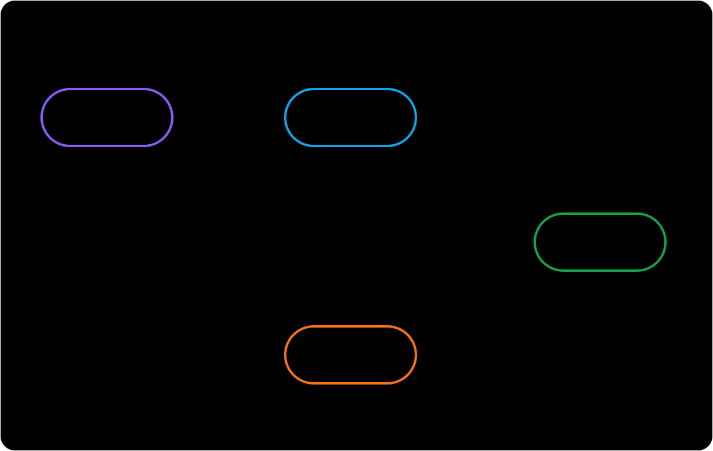

import RunCode from '../../components/RunCode'
import stateTransitionsCode from '@/snippets/run-code/state-transitions.ts?raw'

# 狀態轉換

`State` 表示卡片目前所處的 FSRS 學習階段。透過 `scheduler.newCard()` 建立的卡片初始狀態為 `New`。每次複習時，`DefaultScheduler` 會結合 FSRS 模型結果與學習步驟策略，決定下一個狀態和到期時間。



圖表按顯式步驟和間隔中介軟體處理後的最終排程間隔分類。評分會影響間隔，但不能單獨決定下一個狀態。

`graduatingInterval`（預設 `1`，單位為天）是卡片處於 `Review` 時的最短間隔。最終間隔短於 `graduatingInterval` 時進入或維持 `Learning`/`Relearning`；達到 `graduatingInterval` 時進入 `Review`。步驟被停用或為空、由模型提供間隔時，也適用這項規則。

零時長步驟（如 `0m`，或按秒四捨五入後為零的時長）視為沒有步驟，不支援負數時長。

## 四種狀態

| 狀態 | 含義 | 預設佇列 |
| --- | --- | --- |
| `New` | 卡片是新卡，或已透過 `scheduler.forget()` 重設。 | `new` |
| `Learning` | 卡片需要在 `graduatingInterval` 之內再次進行初始學習，間隔來自顯式步驟或模型。 | `learning` |
| `Review` | 卡片不處於短期學習階段，間隔至少為 `graduatingInterval`。 | `review` |
| `Relearning` | 已複習過的卡片需要在 `graduatingInterval` 之內再次複習，間隔來自顯式步驟或模型。 | `learning` |

## 評分如何改變狀態

評分首先決定是否使用顯式步驟間隔。當 `enableShortTerm: true` 且至少設定了一個步驟時，學習步驟策略如下：

| 評分 | `New` / `Learning` / `Relearning` | `Review` |
| --- | --- | --- |
| `Again` | 回到第一個步驟，`learningStep` 重設為 `0`。 | 使用第一個重新學習步驟，`learningStep` 重設為 `0`。 |
| `Hard` | 保持目前 `learningStep`，使用 Hard 步驟間隔。 | 使用模型間隔，但不短於 `graduatingInterval`；維持 `Review`。 |
| `Good` | 存在下一步時推進；否則畢業進入 `Review`，使用模型間隔，但不短於 `graduatingInterval`。 | 使用模型間隔，但不短於 `graduatingInterval`；維持 `Review`。 |
| `Easy` | 跳過顯式步驟，畢業進入 `Review`，使用模型間隔，但不短於 `graduatingInterval`。 | 使用模型間隔，但不短於 `graduatingInterval`；維持 `Review`。 |

Hard 步驟間隔為前兩個步驟時長的平均值；只有一個步驟時，為該步驟時長的 1.5 倍。步驟為空或 `enableShortTerm: false` 時，所有評分都使用模型間隔，只適用下方的狀態映射。`learningStep` 只在卡片留在 `Learning`/`Relearning` 時保留下一步驟，卡片進入 `Review` 時重設為 `0`。

開啟 `allowModelOverride`（`DefaultScheduler` 對 FSRS-7 預設開啟）時，如果模型間隔比目前步驟長，排程器改用模型間隔。Again 的模型間隔不超過 `graduatingInterval`，使用模型間隔的 Again 總是進入 `Learning`/`Relearning`。Hard 和 Good 的間隔達到 `graduatingInterval` 時，卡片不必走完剩餘步驟即畢業進入 `Review`。模型間隔仍可能被其他間隔中介軟體調整。

**設定了步驟時，走完步驟或按 Easy 會讓卡片進入 `Review`；`Review` 卡片按 Hard、Good 或 Easy 後仍維持 `Review`。**

間隔確定後，`schedulerLearningStepsMiddleware` 再按下表決定狀態。下表描述狀態映射，不代表各評分使用相同的間隔選擇規則：

| 目前狀態 | 最終間隔 < `graduatingInterval` | 最終間隔 ≥ `graduatingInterval` |
| --- | --- | --- |
| `New` | `Learning` | `Review` |
| `Learning` | `Learning` | `Review` |
| `Review` | `Relearning` | `Review` |
| `Relearning` | `Relearning` | `Review` |

有適用的顯式步驟時，排程器保留該步驟設定的時長，除非 `allowModelOverride` 選用了較長的模型間隔。達到 `graduatingInterval` 的步驟仍會讓卡片進入 `Review`。

:::warning Learning 狀態依賴中介軟體
`DefaultScheduler` 自動註冊 `schedulerLearningStepsMiddleware`，且 `enableShortTerm` 預設為 `true`，FSRS-7 也一樣。對於 FSRS-7，此開關控制顯式 `learningSteps` 和 `relearningSteps`，不關閉模型內在的短期記憶，也不控制依間隔進行的狀態映射。即使 `enableShortTerm: false`，模型間隔小於 `graduatingInterval` 時仍會進入 `Learning` 或 `Relearning`。使用 `defineScheduler` 時，需註冊 `.use(schedulerLearningStepsMiddleware)` 才會套用此狀態映射；只組合 FSRS-7 模型而未註冊此中介軟體時，即使排程間隔小於一天，`state` 仍為 `Review`，`scheduleStatus` 仍為 `review`。模型負責記憶狀態和間隔計算，學習狀態轉換由中介軟體負責。如果要讓 FSRS-7 排程後顯示 `Learning`/`Relearning`，請掛載 `schedulerLearningStepsMiddleware`，或自行實作負責狀態轉換的 middleware。
:::

`Rating.Manual` 不是複習評分。呼叫 `review()` 時應傳入 `Again`、`Hard`、`Good` 或 `Easy`。

## 執行狀態轉換

範例使用預設 FSRS-7 和固定設定，並關閉 `allowModelOverride` 以便看清每個步驟。顯式學習及重新學習步驟完成後，Good 以至少一天的間隔畢業進入 `Review`。輔助函式直接使用公開的 `DefaultSchedulerCard`、`Grade` 與 `State` 型別。

`learningStep` 是從零開始的步驟索引，不是複習次數。`Hard`、`Again` 和最後一個 `Good` 範例從同一張處於步驟 `1` 的卡片分別出發：`Hard` 保持索引 `1`（預設 Hard 間隔為 `5.5m`），`Again` 重設為 `0`（`1m`），而 `Good` 因沒有下一步驟而畢業：至少等待 `graduatingInterval`，`learningStep` 重設為 `0` 並進入 `Review`。重新學習範例同理：Again 使用 `10m` 重新學習步驟，隨後 Good 畢業。間隔以分鐘顯示，保留兩位小數。

:::note dueAt 不是 now
`dueAt` 表示卡片應從何時起複習，`now` 是實際複習時間，通常應滿足 `now >= dueAt`。為了讓輸出可以重複驗證且不混淆兩者，本例會在每張卡片的 `dueAt` 後 30 秒進行複習。
:::

```ts twoslash file="../../snippets/run-code/state-transitions.ts"
```

<RunCode code={stateTransitionsCode} />

## Card、revlog 與記憶狀態

- 輸入 `card` 表示複習前的狀態；`review()` 不會修改它。
- `result.card` 包含下一個 `state`、下一組 FSRS 記憶狀態（FSRS-7 的 `stability`、`stabilityFast` 與 `difficulty`）以及新的 `dueAt`。
- `result.revlog` 會連同評分和複習時間記錄先前的狀態與記憶狀態；rollback 也使用這份快照還原卡片。
- `scheduleStatus` 決定卡片進入哪個排程佇列。預設情況下，`New` 對應 `new`，兩個學習狀態對應 `learning`，`Review` 對應 `review`；middleware 可以加入 `suspended` 等佇列狀態，而不會改變四種 FSRS 狀態。

用 `card.state` 解釋學習階段，用 `card.scheduleStatus` 篩選排程佇列。
